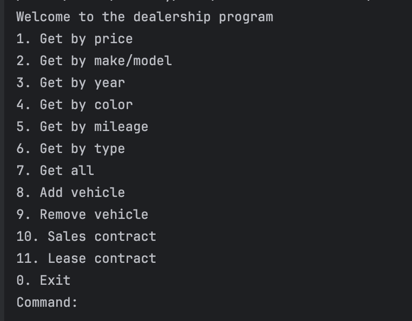

# 🧾New Feature: Sales & Lease Contracts
As part of the updated dealership console system, users can now record vehicle sales and leases, automatically compute financial values, and persist these contracts to a shared file. This aligns with business operations such as handling financing, tax, and payment schedules.

# 💼 Contract Menu Options:
10. Sales contract – Initiates the sales process

11. Lease contract – Initiates the lease process

# 🔧 How It Works
📄 SalesContract
Users can record a vehicle sale and choose whether to finance it. The system calculates:

Sales Tax (5%)

Recording Fee ($100)

Processing Fee:

- $295 for vehicles under $10,000  
- $495 otherwise

Financing (optional):

* 4.25% over 48 months for ≥ $10,000
* 5.25% over 24 months for < $10,000

Monthly payment is computed if financed

### ✅ After confirmation:

The contract is appended to contract.csv

The sold vehicle is removed from the dealership's inventory

## 📄 LeaseContract
Users can also lease vehicles that are 3 years old or newer. The system computes:

Expected Ending Value (50% of price)

Lease Fee (7% of price)

Monthly Payment (4.0% over 36 months)

✅ After confirmation:
* The lease is recorded in contract.csv
* The leased vehicle is removed from the inventory
                                                        

## 🧠Interesting Code 

 I've found the following code to be interesting, because this was my first time working with inheritance. It was interesting actually applying the concept.

public class SalesContract extends Contract{
    private  double salesTaxAmount;
    private  double recordingFee;
    private double processingFee;
    private boolean isFinanced;
    private double monthlyPayment;

    public SalesContract(String date, String customerName, String email, Vehicle vehicleSold, boolean isFinanced) {
        super(date, customerName, email, vehicleSold, 0.0, 0.0);
        this.isFinanced = isFinanced;
        this.salesTaxAmount = getSalesTaxAmount();
        this.recordingFee = getRecordingFee();
        this.processingFee = getProcessingFee();
        this.monthlyPayment = getMonthlyPayment();

    }
